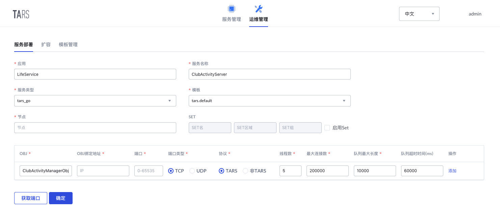

# ClubActivityServer

[中文版](README.md)

ClubActivityServer is one of the backend service of miniparogram LifeService, which can create club and activity event, and manage club and event.

For server interface, see [API Document](docs/RPC.md)

## Structure

```sh
ClubActivityServer
├── client                     # Auto-gen client code
│   ├── client.go
│   └── CMakeLists.txt
├── CMakeLists.txt             # CMake file
├── config.conf                # Default config file [Auto gen]
├── debugtool
│   └── dumpstack.go           # Auto-gen debug code
├── docs                       # docs source file
├── go.mod                     # Go modules file
├── go.sum
├── README.md
├── start.sh                   # Start script [Auto gen]
├── main.go                    # Implement of server
├── clubactivitymanager_imp.go # Implement of interface
├── ServerStatus.tars          # tars file of server status code
├── UserInfoService.tars       # tars file of UserInfoServer
├── ClubActivityManager.tars   # tars file of ClubActivityServer
├── DataService.tars           # tars file of DataServer
└── tars-protocol
    └── LifeService            # tars protocol golang code generated by tars file
```

## Development Environment

* Go >= `1.13.x`, see [Go Installation Document](https://golang.org/doc/install).
* TarsGo, See [TarsGo Installation Document](https://github.com/TarsCloud/TarsGo#Install).

## Build

Clone this project

```sh
git clone https://github.com/TarsDemo/Tars-MiniProgramm-Service-ClubActivityServer.git ClubActivityServer
```

Get into the path of this project and generate the package by the following command

```sh
cd ClubActivityServer
mkdir build
cd build
cmake ..
make 
make ClubActivityServer-tar
```

## Server Deployment

### Deployment Configuration

Go to `TarsWeb->Operation->Deploy service`, and deploy the service according to the following configuration.

* Service info：
    * APP: `LifeService`
    * Service name: `ClubActivityServer`
    * Service type: `tars_go`
    * Template: `tars.go.default`
    * Node: The node that you want to deploy the service.
* Obj info：
    * OBJ: `ClubActivityManagerObj`
    * Protocol: TARS
    * Port: Auto-gen



### Publish Service

Go to `TarsWeb->Services->LifeService->DataServer->Publish`, and

* Choose the node which you just deploy and click `publish node`.
* click `upload release package` and choose the package you just built to upload.
* Select the version you just uploaded in the `release version` list.
* Click `publish` and finish.
